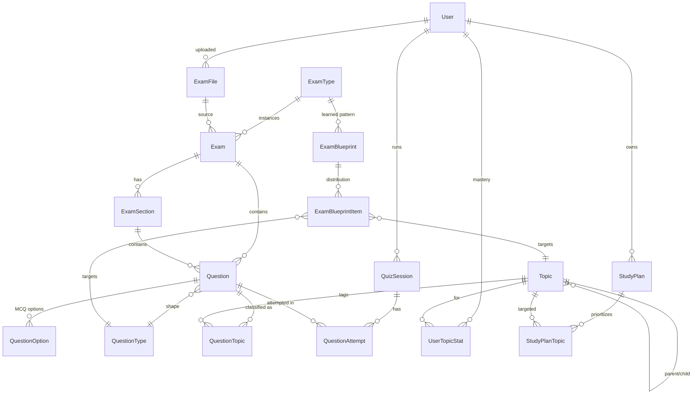

# Database domain

Seven concepts underpin the schema. Getting these separate up front is the whole point of the design.

## 1. Exam Type

**Table**: `exam_types`. Static catalog of exam families we support: `HCMUS_MASTER_ENTRANCE`, `VSTEP_3_5`, `CUSTOM`. An exam type has a level band (`level_from` / `level_to`) but no per-instance data. It's the anchor for blueprints and sessions.

## 2. Exam

**Table**: `exams`. One row = one real exam paper (or one canonical "pattern" exam like the seeded `HCMUS Master Entrance - Canonical Pattern`). Links to `exam_types` and optionally to `exam_files` if it was ingested from a PDF. Has `detected_level` and lifecycle status `DRAFT → ANALYZED → REVIEWED → PUBLISHED`.

## 3. Exam Section

**Table**: `exam_sections`. Rows like `VOCABULARY_READING`, `GRAMMAR_USE_OF_ENGLISH`, `LISTENING`, `SPEAKING` scoped to a specific exam. Ordering is `position`.

## 4. Question Type

**Table**: `question_types`. Global catalog of question *formats* — `MCQ_SINGLE_BLANK`, `CLOZE_TEST`, `SENTENCE_TRANSFORMATION`, `ESSAY`, `LISTENING_MCQ`, ... A question type describes *shape*, not *content*.

## 5. Topic (Taxonomy)

**Table**: `topics`. Hierarchical (parent_id self-FK). Each topic has a `category` (`GRAMMAR|VOCABULARY|READING|LISTENING|WRITING|SPEAKING`). Some topics are tree roots (`TENSES`, `CONDITIONALS`, `WISH`); most are flat leaves. Topic = "what is the question actually about".

Note: `VOCAB_IN_CONTEXT_VOCAB` (vocabulary category) and `VOCAB_IN_CONTEXT_READING` (reading category) are intentionally distinct codes because the same skill appears in two different exam sections.

## 6. Question Classification

**Table**: `question_topics` (composite PK on `question_id + topic_id`). A question can be tagged with N topics; exactly one is `is_primary = true`. `source` (`AI|ADMIN|SYSTEM`) + `confidence` (nullable float) record provenance so an AI classifier can hand off to an admin for verification.

## 7. Exam Blueprint

**Tables**: `exam_blueprints` + `exam_blueprint_items`. Represents the *learned pattern* of an exam type (aggregated across multiple real exam files). Each item slices the target distribution by `section_code` + optional `topic_id` + optional `question_type_id` and stores either `question_count` or a `weight`. The AI question generator consumes blueprint items to sample what to generate.

## Practice & analytics

- `quiz_sessions` — a user's practice or mock-exam run. References `blueprint_id` when the session is generated from a pattern.
- `question_attempts` — one row per submitted answer, tracking correctness, hint level used, and time spent.
- `user_topic_stats` — rolled-up per-user per-topic mastery. Unique on `(user_id, topic_id)`.

## Study plans

- `study_plans` + `study_plan_topics` — AI/system/admin-generated remediation plans that point at weak topics with priorities.

## ER (mermaid)

## Business rule (code)

- `QuestionsService.create` forces `status = DRAFT` when `origin === 'AI_GENERATED'` regardless of what the caller passes. Enforced in `apps/api/src/modules/questions/questions.service.ts`; test in `questions.service.spec.ts`.
