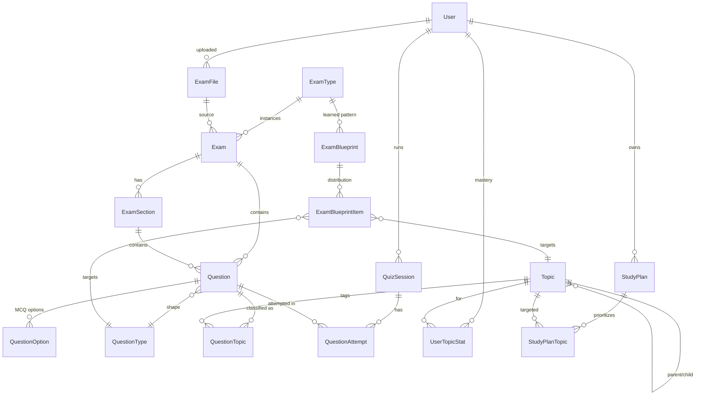

# Database domain

Seven concepts underpin the schema. Getting these separate up front is the whole point of the design.

## 1. Exam Type

`exam_types` identifies a concrete exam format or target family. The source-derived VSTEP format is seeded as `VSTEP`, separately from the broader `B1`/`B2` target types. It must not be confused with `questions.level`, which stores the CEFR level of an individual question.

**Table**: `exam_types`. Static catalog of exam formats and target families we support: `HCMUS_MASTER_ENTRANCE`, `B1`, `B2`, `VSTEP`, `CUSTOM`. An exam type has a level band (`level_from` / `level_to`) but no per-instance data. It's the anchor for blueprints and sessions.

## 2. Exam

**Table**: `exams`. One row = one real exam paper (or one canonical "pattern" exam like the seeded `HCMUS Master Entrance - Canonical Pattern`). Links to `exam_types` and optionally to `exam_files` if it was ingested from a PDF. Has `detected_level` and lifecycle status `DRAFT → ANALYZED → REVIEWED → PUBLISHED`.

## 3. Exam Section

**Table**: `exam_sections`. Rows like `VOCABULARY_READING`, `GRAMMAR_USE_OF_ENGLISH`, `LISTENING`, `SPEAKING` scoped to a specific exam. Ordering is `position`.

## 4. Question Type

**Table**: `question_types`. Global catalog of question *formats* — `MCQ_SINGLE_BLANK`, `CLOZE_TEST`, `SENTENCE_TRANSFORMATION`, `ESSAY`, `LISTENING_MCQ`, ... A question type describes *shape*, not *content*.

## 5. Topic (Taxonomy)

Topics are controlled, reusable content/skill labels—not question formats. `question_types` describes the response/task form, while `topics` describes the skill, grammar point, writing prompt category, or speaking subject. A question can have multiple topic links and exactly one primary classification.

VSTEP is represented data-first: the canonical exam has Listening (35/3 parts/40 minutes), Reading (40/4 passages/60 minutes), Writing (2 tasks/60 minutes), and Speaking (3 parts/about 12 minutes). Its blueprint stores the Listening forms (`ANNOUNCEMENT_INSTRUCTION` 8, `CONVERSATION` 12, `TALK_LECTURE` 15), Reading, Writing, and Speaking distributions. Writing scoring dimensions are currently controlled topic labels for future rubric work; AI scoring is intentionally deferred.

**Table**: `topics`. Hierarchical (parent_id self-FK). Each topic has a `category` (`GRAMMAR|VOCABULARY|READING|LISTENING|WRITING|SPEAKING`). Some topics are tree roots (`TENSES`, `CONDITIONALS`, `WISH`); most are flat leaves. Topic = "what is the question actually about".

Note: `VOCAB_IN_CONTEXT_VOCAB` (vocabulary category) and `VOCAB_IN_CONTEXT_READING` (reading category) are intentionally distinct codes because the same skill appears in two different exam sections.

## 6. Question Classification

**Table**: `question_topics` (composite PK on `question_id + topic_id`). A question can be tagged with N topics; exactly one is `is_primary = true`. `source` (`AI|ADMIN|SYSTEM`) + `confidence` (nullable float) record provenance so an AI classifier can hand off to an admin for verification.

## 7. Exam Blueprint

**Tables**: `exam_blueprints` + `exam_blueprint_items`. Represents the *learned pattern* of an exam type (aggregated across multiple real exam files). Each item slices the target distribution by `section_code` + optional `topic_id` + optional `question_type_id` and stores either `question_count` or a `weight`. The AI question generator consumes blueprint items to sample what to generate.

## Source/material role

`questions.origin` answers who/what created a question (`ORIGINAL`, `MANUAL`, `AI_GENERATED`). `questions.content_role` separately identifies its role in source material: `EXAMPLE`, `PRACTICE`, `MOCK_EXAM`, `REAL_EXAM`, or `AI_GENERATED`. This prevents instructional/source classification from being overloaded into creation provenance.

## VSTEP format (source-derived)

`ExamType` code `VSTEP` identifies the concrete VSTEP 3-5 exam format; it is not a CEFR question level. The seeded canonical exam has four `ExamSection` rows: `LISTENING` (35 questions, 3 parts, 40 minutes), `READING` (40 questions, 4 passages, 60 minutes), `WRITING` (2 tasks, 60 minutes), and `SPEAKING` (3 parts, approximately 12 minutes). `ExamBlueprint` items express the listening split (8/12/15) and the writing/speaking task structure as data.

Question `questionType` describes the response/form (for example `READING_COMPREHENSION`, `ANNOUNCEMENT_INSTRUCTION`, `LETTER_EMAIL`, or `SOCIAL_INTERACTION`). `Topic` is the controlled reusable skill, task category, rubric dimension, or speaking subject and is linked independently through `question_topics`; one link may be primary and additional links may be secondary. Thus a VSTEP reading comprehension question can have type `READING_COMPREHENSION` and primary topic `MAIN_IDEA` or `REFERENCE`.

`Question.origin` remains creation provenance (`ORIGINAL`, `MANUAL`, `AI_GENERATED`). `Question.contentRole` is a separate instructional/material role (`EXAMPLE`, `PRACTICE`, `MOCK_EXAM`, `REAL_EXAM`, `AI_GENERATED`), so an admin-authored example is representable without overloading origin. AI-generated content is still forced to `DRAFT`.

VSTEP writing prompt categories (`AGREE_DISAGREE`, `DISCUSS_BOTH_SIDES`, `PROBLEM_SOLUTION`) and speaking subjects (`HOMETOWN`, `HOLIDAYS`, `JOB`, `TRANSPORT`, `NEWS_NEWSPAPERS`, `SOUND_NOISE`) are topics, not question types. Writing rubric dimensions are seeded as controlled topics for classification/reporting only; no automated writing scoring is implemented.

## Practice & analytics

- `quiz_sessions` — a user's practice or mock-exam run. References `blueprint_id` when the session is generated from a pattern. `type` includes `MIXED_PRACTICE | TOPIC_PRACTICE | CUSTOM_PRACTICE | MOCK_EXAM | MISTAKE_REVIEW`. `MISTAKE_REVIEW` pulls distinct-questionId rows from `question_attempts` where `is_correct = false` (`MistakeReviewService.list`).
- `question_attempts` — one row per submitted answer, tracking correctness, `hint_level_used`, and time spent. **Attempts are created only on submit** (`POST /practice/sessions/:id/answers`); the hint reveal endpoint is read-only and never mutates prior rows. The client sends the currently-visible hint level in `hintLevelUsed` at submit time.
- `user_topic_stats` — rolled-up per-user per-topic mastery. Unique on `(user_id, topic_id)`. Powers `GET /me/dashboard.weakTopics` and `/progress`.

## User target vs question level

`users.current_exam_type_id` (nullable FK → `exam_types.id`) records the target the user is currently studying for (for example `B2` or `HCMUS_MASTER_ENTRANCE`). Set via `POST /auth/register` (optional) or `PATCH /me/study-target`. This is a **separate axis** from `questions.level`, which is the CEFR difficulty tag on a single question. A B2 target may include B1-level questions and vice versa; blueprints control the actual composition, not `level` alone.

## Global question bank invariant

`questions` is ONE shared table across all users. There is no `user_id` FK on `Question` and there will not be one. Users are scoped to questions through `question_attempts` (their history) and `user_topic_stats` (their mastery). The invariant is documented in a comment block above `model Question` in `packages/database/prisma/schema.prisma`.

## Study plans

- `study_plans` + `study_plan_topics` — AI/system/admin-generated remediation plans that point at weak topics with priorities.

## ER (mermaid)

## Business rule (code)

- `QuestionsService.create` forces `status = DRAFT` when `origin === 'AI_GENERATED'` regardless of what the caller passes. Enforced in `apps/api/src/modules/questions/questions.service.ts`; test in `questions.service.spec.ts`.
