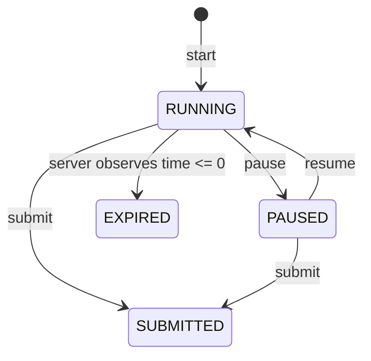

# Mock exam lifecycle

Mock exams are timed assessments, separate from practice. They save answers while running or paused, but never return hints, answer keys, or explanations until submission.

## State machine

Valid transitions are `RUNNING -> PAUSED`, `PAUSED -> RUNNING`, and either active state to `SUBMITTED`. A running session whose authoritative remaining time reaches zero becomes `EXPIRED`. Submitted and expired sessions are terminal.

## Timer and pause semantics

The server is authoritative. For a session with `durationSeconds`:

`remaining = max(0, durationSeconds - floor((clockNow - startedAt) / 1000) + totalPausedSeconds)`

While paused, `clockNow` is `pausedAt`, so active time stops immediately. Resuming adds the completed pause duration to `totalPausedSeconds` and clears `pausedAt`. The browser may display a countdown, but every state/answer/submit operation rechecks server time.

## API contracts

- `POST /mock-exams`: creates a blueprint-backed mock in `RUNNING`; accepts `examTypeId`, optional `blueprintId`, `totalQuestions`, and `durationSeconds`.
- `GET /mock-exams/:id`: returns owned resumable state, safe question/options, saved answers, status, position, and `remainingSeconds`.
- `POST /mock-exams/:id/answers`: idempotently upserts `{questionId, selectedOptionId, answerText, currentQuestionIndex}`.
- `POST /mock-exams/:id/pause`: pauses a running session.
- `POST /mock-exams/:id/resume`: resumes a paused session.
- `POST /mock-exams/:id/submit`: scores saved answers and transitions to `SUBMITTED` or `EXPIRED`.

## Autosave and retries

Autosave is per session/question and protected by a unique key. Retrying the same request updates the same row and does not create duplicate attempts. Network failures are retryable; clients should retain the pending selection and retry after refresh. A session can be resumed from another device using the same authenticated account.

## Ownership and leakage rules

Every endpoint verifies the authenticated user owns the session and that it is a mock session. Missing or foreign sessions return not-found semantics. Pre-submit payloads omit `isCorrect`, option explanations, hints, and answer data. Scoring is performed only on submit/expiry.

## UX expectations

Mock mode has a visible server-synchronised timer, clear Running/Paused/Expired/Submitted state, Pause & Exit, Resume, next/previous navigation, immediate answer save feedback, and a final submit confirmation. Refresh and logout should return the learner to the saved position and remaining time. Review can show the score and teaching detail after submission.

## Result calculation

Final score is calculated from the saved option selections against the global question bank. The existing question-topic links remain the source for topic result aggregation; blueprint item/section metadata remains unchanged.
